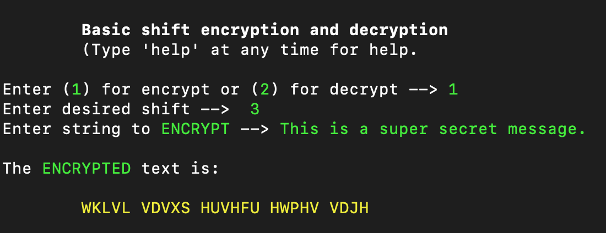
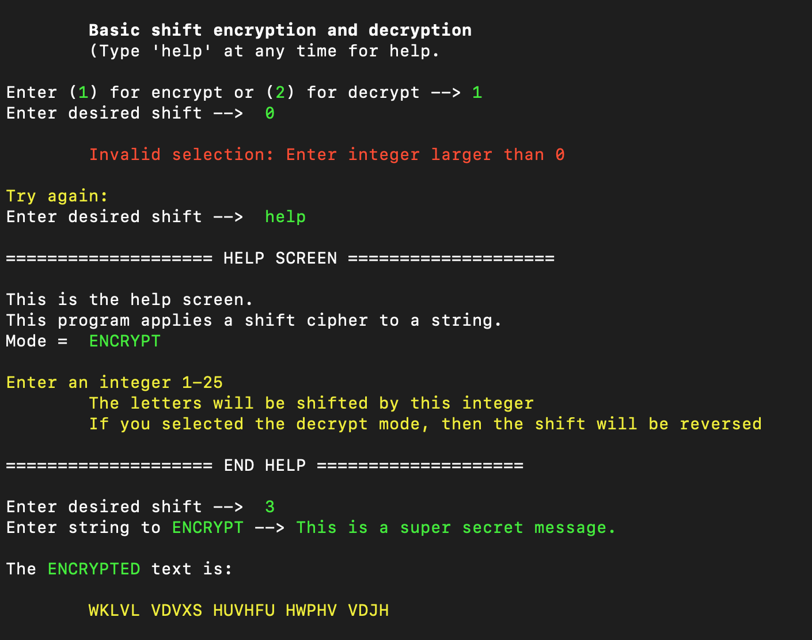

# Kim's shift-cipher project

It's understandable that you will use google for this project. Your goal should be to google the smallest piece necessary and not find full examples of a shift cipher to copy. The more you think through how to solve the tasks on your own and just use google for things like understanding the syntax, the more you will gain from this project. 

You are making this program for other people to use. You want the instructions and help messages to be clear and easy to understand. You want the UI to be consistant so your users will enjoy using it and not be frustrated with it. 

# Level 1
## Goals 
1. Take lower case text from a user
2. Apply a caesar chipher (shift 3)
3. Print the encoded text

## Rules: 
1. Do not import anything

## Notes:
1. Ciphertext == Encrypted text
2. Cleartext == Non-encrypted text 
3. Learn about the ASCII table
4. Learn about the basic Caesar cipher
4. You will need to use the built in chr() and ord() functions
5. Save each version of your program at each level as a seperate file so you have a clear veiw of your progress. 

## Test conditions
1. Encrypt  
input -> abc  
output -> def  

# Level 2 

## Goals

1. Accept user input that contains text encrypted with the caesar cipher (shift 3)
2. Decode the text
3. Print the decoded text back to the user

## Rules: 
1. Do not import anything

## Notes:
1. This program will need to let the user choose to enter cleartext or ciphertext 

## Test conditions
1. Encrypt  
User chooses to option encrypt  
input -> abc  
output -> def  
2. Decrypt  
User chooses to option dencrypt  
input -> def  
output -> abc  

# Level 3

## Goals
1. Accept uppercase and lowercase cleartext and ciphertext
2. The output will always be uppercase (abc -> DEF)
3. Ignore punctuation (A!B?C -> DEF)
4. Pass numbers through unchanged  (ABC123 -> DEF123)

## Rules:
1. Do not import anything

# Level 4

## Goals
1. Allow the user to choose the number to shift by
2. Print out the cipher text in blocks of 5 characters seperated by a space (abcdefghijklmnopqr -> DEFGH IJKLMN OPQRS TU)

## Rules:
1. Do not import anything

# Level 5
## Goals
1. Don't let the user see any traceback errors. Think about all the mistakes a user could make. Rather than letting your program error out, just print a friendly error message. Don't have the program exit, let them try their input again.

## Rules:
1. Do not import anything

## Notes
1. Its never good to dump a huge error with tracebacks to the screen. As a programmer, you know what it means and what to look for, but a user will not have a clue what to do. So any time there could be an issue, catch the error in a try...except block and handle the issue. 
2. An example of this could be if you ask the user for how many places they want to shift the letters and they insted type 'pizza'. If your program is expecting a number, it might crash. 

# Level 6
## Goals
1. Allow the user to type 'help' at any time. You should then print some useful information. What is the program currently asking for? Is the program set to encrypt or decrypt? 
2. Allow the user to type 'q' or 'quit' at any time and exit the program. 

## Rules:
1. Do not import anything

## Notes
1. If the user types 'help', the program should then continue, not exit. 

# Level 7
## Goal
1. Use color in your output to make the whole program more user freindly. See example below:

### Red is a great color to show any errors

## Rules:
1. Do not import anything
